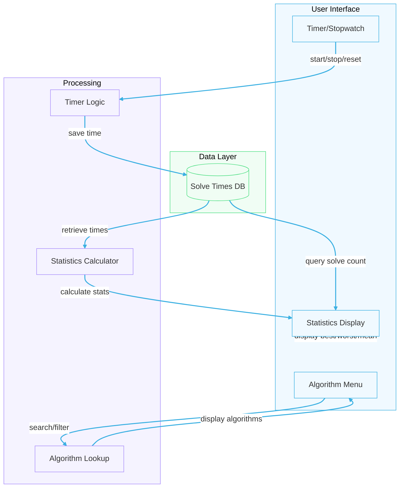

# CSI-2300-Project-Rubik-s-cube-timer
Project Name: Rubik's Cube Scrambler
Team Name: Solo Brew
Team members: Myles Collier

Build Desription: I will be building a Rubiks Scrambler for my CSI 2300 course project. This Scrambler will provide functionalities that will be useful to someone who solve Rubik's Cubes competitively so that they can practice. This project will mirror similar types of tools that are aids to speed cubers. 

The first function of this project will be a timer that acts as a stopwatch. Once this stopwatch has been used the time will be entered into a database and the stopwatch will be automatically reset for the next solve.

For the times that have been entered into the database certain information will be made such as best time, worst time, and mean solve time as well as the solve number being displayed.

There will also be a menu section for algorithms that are helpful to the solver so that they can can lookup whichever ones they mmay have forgotten or just want to refresh up on.

Why I want to build my project: I have been speed solving rubik's cubes and many other simlary twisty puzzles. I wanted to make something that I would like to use and that would be useful to me. In choosing this for my project I would also be able to take similar softwares that i have used and make the version that has all of the most helpful parts put together.

